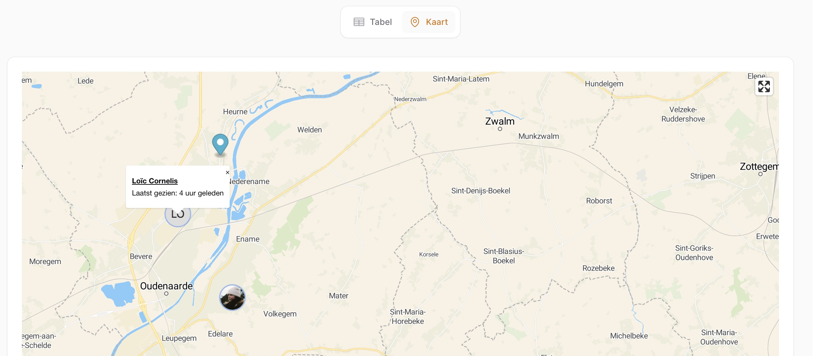

# Package to display maps using MapLibre

[](https://packagist.org/packages/nwn-software/maplibre)
[](https://github.com/nwn-software/maplibre/actions?query=workflow%3Arun-tests+branch%3Amain)
[](https://github.com/nwn-software/maplibre/actions?query=workflow%3A"Fix+PHP+code+styling"+branch%3Amain)
[](https://packagist.org/packages/nwn-software/maplibre)

This is where your description should go. Limit it to a paragraph or two. Consider adding a small example.




## Installation

You can install the package via composer:

```bash
composer require nwn-software/maplibre
```

You can publish and run the migrations with:

```bash
php artisan vendor:publish --tag="maplibre-migrations"
php artisan migrate
```

You can publish the config file with:

```bash
php artisan vendor:publish --tag="maplibre-config"
```

Optionally, you can publish the views using

```bash
php artisan vendor:publish --tag="maplibre-views"
```

This is the contents of the published config file:

```php
return [
    'style' => env('MAPLIBRE_STYLE', 'https://demotiles.maplibre.org/style.json'),
];
```

## Usage

1. Register the plugin on your panel

```php
MaplibrePlugin::make()
    ->style(config('maplibre.style'))
```

2. Create a filament widget

```bash
php artisan make:filament-widget MapWidget
```

2. Extend with the `NWNSoftware\Maplibre\Widgets\MapLibreWidget`

```php
<?php

namespace App\Filament\App\Widgets;

use App\Models\Employee;
use App\Models\User;
use NWNSoftware\Maplibre\Data\MarkerData;
use NWNSoftware\Maplibre\Widgets\MapLibreWidget;

class MapWidget extends MapLibreWidget {

    protected array $center = [0, 0];

    protected int $zoom = 9;

    protected bool $allowFullscreen = true;

    public function getMarkers(): array {
        return [];
    }
}
```

### Return markers with the MarkerData class

The MarkerData is a class which wraps all functions available right now, to the proper array format.

```php
<?php

namespace App\Filament\App\Widgets;

use App\Models\Employee;
use App\Models\User;
use NWNSoftware\Maplibre\Data\MarkerData;
use NWNSoftware\Maplibre\Widgets\MapLibreWidget;

class MapWidget extends MapLibreWidget {

    protected array $center = [0, 0];

    protected int $zoom = 9;

    protected bool $allowFullscreen = true;

    public function getMarkers(): array {
        return collect($devicePositions)->map(function ($devicePosition) {
            return MarkerData::make()
                ->id($employee->id)
                ->longitude($devicePosition['Position'][0])
                ->latitude($devicePosition['Position'][1])
                ->toArray();
        })->all();
    }
}
```

### Navigating to a point on the map

```php
$lon = $lat = 0;
$center = [$lon, $lat];
$this->dispatch('maplibre--flyTo', $center);
```

### Using an icon as a marker

```php
return MarkerData::make()
    ->id($employee->id)
    ->longitude($devicePosition['Position'][0])
    ->latitude($devicePosition['Position'][1])
    ->avatarUrl($employee->getAvatarUrl())
    ->avatarIconSize(40)
```

### Clicking on a marker

#### Opening an infolist when clicking on a marker

If you set a popup or locate to a URL this action will be ignored.

```php
<?php

namespace App\Filament\App\Widgets;

use App\Models\Employee;
use App\Models\User;
use NWNSoftware\Maplibre\Data\MarkerData;
use NWNSoftware\Maplibre\Widgets\MapLibreWidget;
use Filament\Infolists\Infolist;

class MapWidget extends MapLibreWidget {

    protected array $center = [0, 0];

    protected int $zoom = 9;

    public Model | string | null $model = Employee::class;

    public function getMarkers(): array {
        return collect($devicePositions)->map(function ($devicePosition) {
            return MarkerData::make()
                ->id($employee->id)
                ->longitude($devicePosition['Position'][0])
                ->latitude($devicePosition['Position'][1])
                ->toArray();
        })->all();
    }

    public function getInfolistSchema(Infolist $infolist): Infolist
    {
        return $infolist
            ->schema([
            ]);
    }
}
```

#### Opening a popup when clicking on a marker

```php
 MarkerData::make()
    ->id($employee->id)
    ->longitude($devicePosition['Position'][0])
    ->latitude($devicePosition['Position'][1])
    ->popupText("Here goes your HTML")
    ->toArray();
```

#### Navigating to a URL when clicking on a marker

```php
 MarkerData::make()
    ->id($employee->id)
    ->longitude($devicePosition['Position'][0])
    ->latitude($devicePosition['Position'][1])
    ->url("https://google.be")
    ->shouldOpenUrlInNewTab()
    ->toArray();
```

## Testing

```bash
composer test
```

## Changelog

Please see [CHANGELOG](CHANGELOG.md) for more information on what has changed recently.

## Contributing

Please see [CONTRIBUTING](.github/CONTRIBUTING.md) for details.

## Security Vulnerabilities

Please review [our security policy](../../security/policy) on how to report security vulnerabilities.

## Credits

-   [nwnsoftware](https://github.com/NWN-Software)
-   [All Contributors](../../contributors)

Since this is my first plugin, the code and structure for this was heavily inspired by Saade his [Filament Fullcalendar Plugin](https://github.com/saade/filament-fullcalendar).

## License

The MIT License (MIT). Please see [License File](LICENSE.md) for more information.
